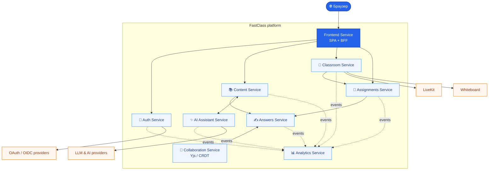

# FastClass

> Платформа для создания интерактивных уроков по английскому языку.

FastClass объединяет создание учебных материалов, работу с классами и
заданиями, ответы учеников, совместное редактирование и AI-инструменты в одном
наборе сервисов. Весь проект запускается единым Docker Compose-стеком.

## Возможности

| | |
|---|---|
| 📚 | Создание, хранение и переиспользование уроков и материалов |
| 👥 | Управление классами, учениками и приглашениями |
| 📝 | Назначения, дедлайны и ответы учеников |
| ✍️ | Совместное редактирование письменных работ в реальном времени |
| ✨ | Генерация материалов и подсказок с помощью AI |
| 📊 | Аналитика активности и качества материалов |

## Архитектура



> Сплошные линии обозначают синхронные API-вызовы, пунктирные — события,
> поступающие в аналитический контур.

## Сервисы

| Сервис | Назначение |
|---|---|
| **Auth Service** | Идентификация пользователей: гостевой доступ и вход через подключаемых OAuth/OIDC-провайдеров. Поддерживаются Yandex и VK; другие провайдеры, включая CU ID, добавляются конфигурацией. |
| **Frontend Service** | Точка входа для браузера и BFF-слой: раздаёт frontend, хранит сессию в HTTP-only cookie и проксирует запросы к API. |
| **Content Service** | Управляет учебными материалами: уроками, копиями, файлами и обработкой загруженных материалов. |
| **Classroom Service** | Управляет классами и составом учеников; интегрируется с внешними whiteboard- и LiveKit-сервисами. |
| **Assignments Service** | Назначает материалы ученикам и классам, отслеживает дедлайны и отправляет уведомления через WebSocket. |
| **Answers Service** | Хранит ответы, черновики и статусы сдачи, принимает снимки совместного редактирования. |
| **Collaboration Service** | Обеспечивает совместное редактирование письменных ответов в реальном времени на базе Yjs/CRDT. |
| **AI Assistant Service** | Создаёт учебный контент с помощью LLM: черновики уроков, подсказки, изображения и результаты AI-генераций. |
| **Analytics Service** | Собирает аналитику пользовательской активности и качества материалов для администраторов. |

## Быстрый запуск

**Требования:** Docker Engine и Docker Compose v2.

```bash
# 1. Создать runtime-конфигурацию
cp .env.example .env

# 2. Указать OAuth-данные и заменить development-секреты перед публичным запуском

# 3. Собрать и запустить весь стек
docker compose up --build -d
```

Compose автоматически создаёт JWT-ключи и выполняет миграции БД до старта
приложений.

### Полезные команды

```bash
# Состояние контейнеров
docker compose ps

# Логи всего стека
docker compose logs -f

# Логи одного сервиса
docker compose logs -f frontend-service

# Остановить стек
docker compose down

# Остановить стек и удалить локальные данные PostgreSQL
docker compose down -v
```

После запуска frontend по умолчанию доступен по адресу
[`http://localhost:8080`](http://localhost:8080).

## Конфигурация

Единый конфигурационный файл — [`.env.example`](.env.example). В нём задаются:

- OAuth-провайдеры и публичные URL;
- секреты межсервисного взаимодействия;
- cookie и CORS;
- host-порты;
- LiveKit, Whiteboard и AI-интеграции;
- OpenTelemetry.

Перед размещением в публичной среде обязательно замените все development-секреты
случайными значениями, укажите публичные `PUBLIC_BASE_URL` и
`AUTH_SERVICE_PUBLIC_BASE_URL`, а для HTTPS включите `COOKIE_SECURE=true`.

Подробнее по инфраструктурным требованиям — в [CHECKLIST.md](CHECKLIST.md).

## Контакты

По вопросам проекта: Telegram [@Arseniy1904](https://t.me/Arseniy1904).
